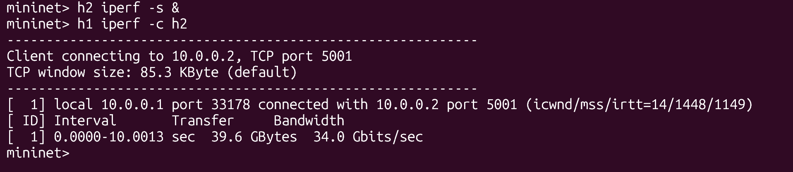
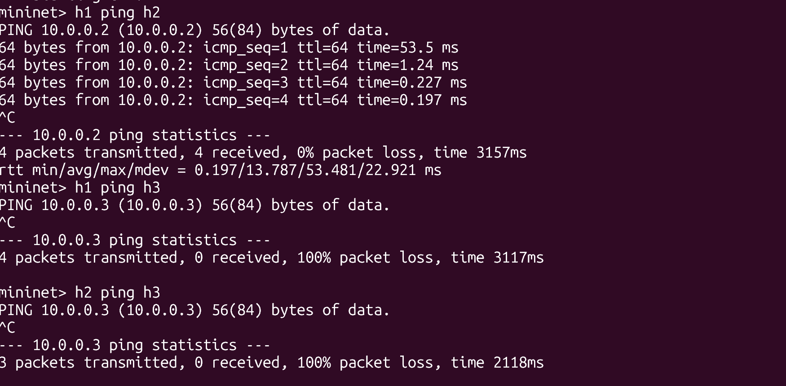
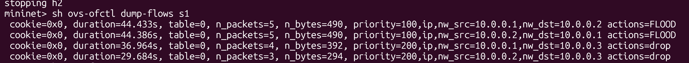
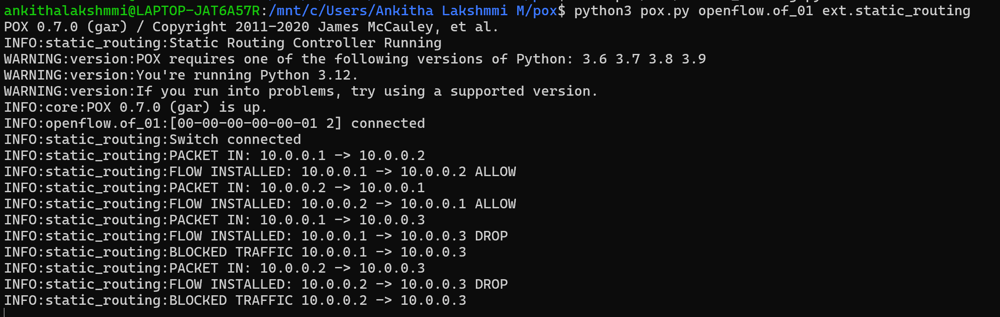

Static Routing using SDN Controller (POX + Mininet)
1. Problem Statement

The objective of this project is to implement static routing in a Software Defined Network (SDN) using a controller-based approach. The controller (POX) installs flow rules in the switch to control packet forwarding behavior.

The project demonstrates:

Controller–switch interaction
Flow rule design using match–action logic
Network behavior observation
2. Objective
Implement static routing using OpenFlow rules
Handle packet_in events in the controller
Allow and block traffic using controller logic
Evaluate performance using ping and iperf
3. Tools and Technologies Used
Mininet
POX Controller
Open vSwitch
iperf
ping
4. Network Topology

Topology consists of:

1 Switch (s1)
3 Hosts:
h1 → 10.0.0.1
h2 → 10.0.0.2
h3 → 10.0.0.3

All hosts are connected to a single switch.

5. Setup and Execution Steps
Step 1: Start POX Controller
cd pox
python3 pox.py ext.static_routing
Step 2: Run Mininet
sudo mn --custom custom_topo.py --topo mytopo --controller=remote --switch ovsk
Step 3: Test Connectivity
h1 ping h2
6. Controller Logic

The controller:

Handles packet_in events
Extracts source and destination IP
Applies match–action rules
Forwards or drops packets
Blocking Rule

Traffic from:

10.0.0.1 → 10.0.0.3

is blocked.

7. Test Scenarios
Scenario 1: Allowed Traffic
h1 ping h2
h2 iperf -s
h1 iperf -c h2
Output:

Scenario 2: Blocked Traffic
h1 ping h3
h1 iperf -c h3
Output:

Scenario 3: Normal vs Failure

Simulate link failure:

link s1 h2 down
h1 ping h2

Restore:

link s1 h2 up
Output:

8. Flow Table Verification
ovs-ofctl dump-flows s1
Output:

9. Controller Logs

Logs showing packet handling and blocking:

10. Performance Analysis
Latency
Low latency for allowed traffic
No response for blocked traffic
Throughput
High throughput using iperf for allowed traffic
No throughput for blocked traffic
Flow Behavior
Flow rules installed dynamically
Blocked traffic dropped

Initialization 

iperf Throughput Result

Allowed/Blocked Traffic 

Flow Table Output

Controller Logs (POX)

